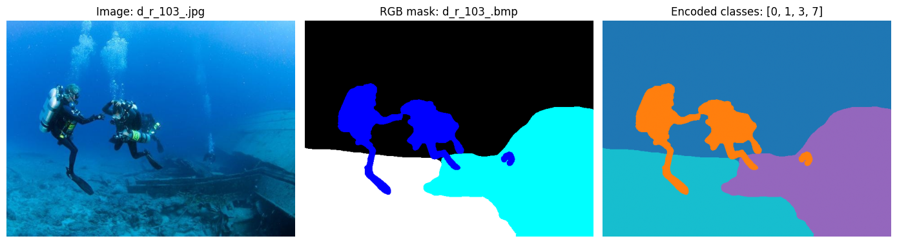
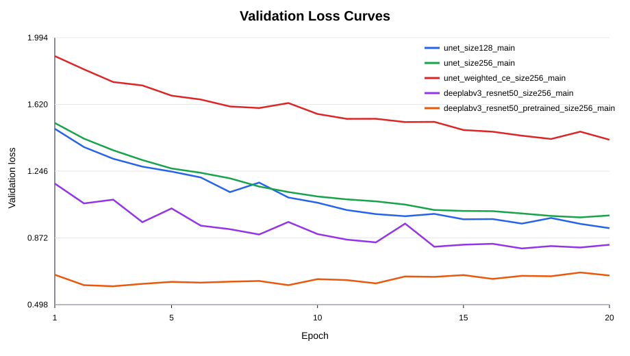
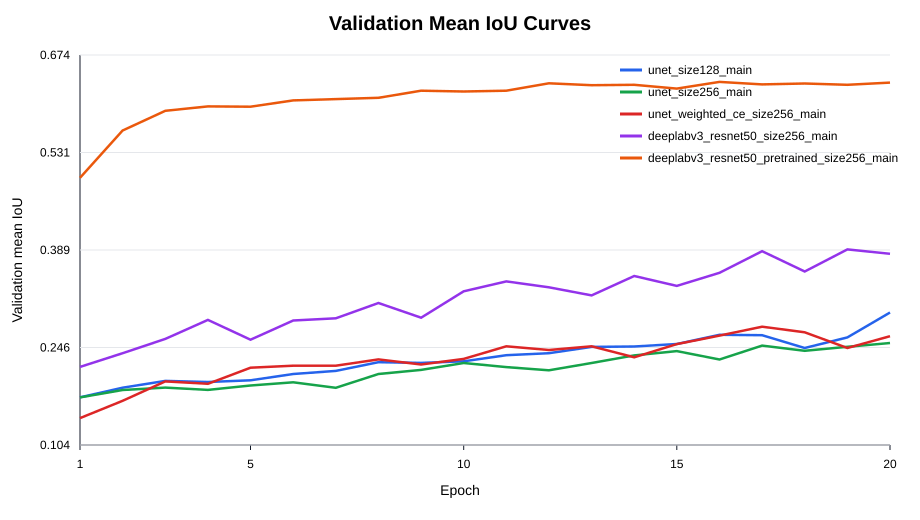
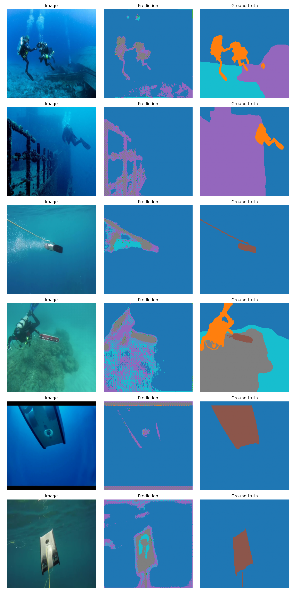

# Underwater Segmentation

Портфолио-проект по 8-классовой семантической сегментации подводных сцен на
PyTorch. Репозиторий содержит воспроизводимый CLI-пайплайн, Kaggle runner,
Kaggle notebook с выполненными экспериментами и реальные результаты обучения.

## STAR

### Situation

Подводные изображения сложны для сегментации: низкий контраст, синий/зелёный
цветовой сдвиг, мутность, мелкие объекты и сильный дисбаланс классов. Исходный
baseline был notebook-ориентированным, а данные SUIM на Kaggle имеют структуру
`train_val/` и `TEST/`, поэтому старые учебные предположения о layout были убраны.

### Task

Нужно было превратить эксперимент в чистый portfolio-ready репозиторий:
сохранить U-Net baseline, добавить DeepLabV3 ResNet50, корректно читать
8-классовые RGB-маски, запускать серию Kaggle-экспериментов, сохранять метрики,
кривые, визуализации и аккуратно документировать реальные результаты.

### Action

- Датасет вынесен в `src/dataset.py`; RGB-маски кодируются в классы `0..7` по
  правилу `(mask > 100) @ [4, 2, 1]`.
- Добавлена fallback-логика путей: сначала `train/images`, затем
  `train_val/images`; для теста сначала `test/images`, затем `TEST/images`.
- Модели: `unet` и `deeplabv3_resnet50`, обе с выходом на 8 классов.
- Loss: `CrossEntropyLoss`, опционально weighted CE.
- Метрики: pixel accuracy, mean IoU и per-class IoU.
- Kaggle runner запускает 5 основных экспериментов на 20 эпох.
- Предсказания сохраняются как raw class-id masks и как цветные RGB-визуализации.

### Result

Лучший результат показал `DeepLabV3 ResNet50` с pretrained backbone:
`mean IoU = 0.634414`, `pixel accuracy = 0.822570`. Pretrained backbone дал
самый заметный прирост качества, weighted CE улучшил mean IoU для U-Net 256, но
снизил pixel accuracy, а U-Net на `image_size=128` оказался лучше U-Net 256 по
mean IoU в этой серии экспериментов.

## Dataset

Канонический Kaggle dataset:

```text
/kaggle/input/datasets/ashish2001/semantic-segmentation-of-underwater-imagery-suim/
├── train_val/
│   ├── images/
│   └── masks/
└── TEST/
    └── images/
```

В выполненном Kaggle notebook:

- GPU: Tesla T4;
- train/validation images: 1525;
- train/validation masks: 1525;
- test images: 110.

Код также поддерживает fallback-структуру:

```text
train/images -> train_val/images
train/masks  -> train_val/masks
test/images  -> TEST/images
```

Выбранные директории печатаются в логах `train.py`, `evaluate.py`, `predict.py`,
`visualize.py` и `scripts/run_kaggle_experiments.sh`.



*Пример изображения, RGB-маски и 8-классовой индексной маски из SUIM.*

## Repository Structure

```text
src/
  dataset.py      # Dataset, RGB->class encoding, palette, path fallback
  model.py        # U-Net and DeepLabV3 ResNet50
  metrics.py      # pixel accuracy, mean IoU, per-class IoU
  train.py        # training and experiment CSV logging
  evaluate.py     # checkpoint evaluation
  predict.py      # submission, raw masks, colored masks
  visualize.py    # qualitative examples
scripts/
  run_kaggle_experiments.sh
notebooks/
  kaggle_underwater_experiments.ipynb
  kaggle_experiments_done.ipynb
experiments/
  experiment_plan.md
  results.csv
assets/
  dataset_examples.png
  prediction_examples.png
  loss_curves.svg
  miou_curves.svg
```

## Installation

```bash
python3 -m venv .venv
source .venv/bin/activate
pip install -r requirements.txt
```

## Kaggle Training

Основной runner использует 20 эпох, потому что лучший предыдущий результат был
достигнут после 20 эпох:

```bash
chmod +x scripts/run_kaggle_experiments.sh
./scripts/run_kaggle_experiments.sh
```

По умолчанию:

```bash
DATA_DIR=/kaggle/input/datasets/ashish2001/semantic-segmentation-of-underwater-imagery-suim
WORKING_DIR=/kaggle/working
```

Smoke-test режим запускает те же эксперименты на 1 эпоху:

```bash
./scripts/run_kaggle_experiments.sh --smoke
```

Все generated outputs пишутся в `/kaggle/working`:

- checkpoints: `/kaggle/working/checkpoints`;
- CSV: `/kaggle/working/experiments/results.csv`;
- plots and visualizations: `/kaggle/working/assets`;
- raw predictions: `predictions_raw/`;
- colored predictions: `predictions_color/`.

## Experiments

Реальные результаты из `experiments/results.csv`, полученные на Kaggle/Tesla T4.
В таблице ниже оставлены основные 20-эпоховые эксперименты; 1-эпоховые sanity
runs сохранены в CSV, но не используются для сравнения качества.

| Experiment | Model | Image size | Weighted CE | Pretrained backbone | Best val mIoU | Best val pixel acc |
|---|---:|---:|---:|---:|---:|---:|
| `unet_size128_main` | U-Net | 128 | no | no | 0.297318 | 0.698849 |
| `unet_size256_main` | U-Net | 256 | no | no | 0.252723 | 0.678170 |
| `unet_weighted_ce_size256_main` | U-Net | 256 | yes | no | 0.276628 | 0.553481 |
| `deeplabv3_resnet50_size256_main` | DeepLabV3 ResNet50 | 256 | no | no | 0.389566 | 0.725624 |
| `deeplabv3_resnet50_pretrained_size256_main` | DeepLabV3 ResNet50 | 256 | no | yes | **0.634414** | **0.822570** |

### Best Model

Лучший checkpoint: `deeplabv3_resnet50_pretrained_size256_main`.

Конфигурация:

- model: `deeplabv3_resnet50`;
- pretrained backbone: yes;
- image size: 256;
- epochs: 20;
- batch size: 16;
- lr: `1e-4`;
- weighted CE: no.

### Impact: Pretrained Backbone

DeepLabV3 ResNet50 без pretrained backbone: `mIoU = 0.389566`.
DeepLabV3 ResNet50 с pretrained backbone: `mIoU = 0.634414`.

Прирост: `+0.244848 mIoU` и `+0.096946 pixel accuracy`. Это самый сильный
эффект в проведённой серии.

### Impact: Weighted CE Loss

U-Net 256 без weighting: `mIoU = 0.252723`, `pixel acc = 0.678170`.
U-Net 256 с weighted CE: `mIoU = 0.276628`, `pixel acc = 0.553481`.

Weighted CE повысил mean IoU на `+0.023905`, но заметно снизил pixel accuracy.
По per-class IoU видно, что weighting помогает редким классам: например,
class 1 вырос с `0.000000` до `0.184823`, class 2 с `0.000000` до `0.077282`,
class 4 с `0.000000` до `0.115001`.

### Impact: Image Size

U-Net 128: `mIoU = 0.297318`.
U-Net 256: `mIoU = 0.252723`.

В этой серии U-Net на 128 показал результат выше на `+0.044595 mIoU`. Возможная
причина — компактная U-Net легче оптимизировалась на меньшем разрешении при тех
же 20 эпохах.

## Training Curves



*Validation loss по эпохам для пяти основных Kaggle-экспериментов.*



*Validation mean IoU по эпохам для пяти основных Kaggle-экспериментов.*

## Prediction Visualization

Раньше raw predicted masks сохранялись как PNG с class ids `0..7`, поэтому при
обычном просмотре выглядели почти чёрными. Теперь `predict.py` сохраняет две
версии:

- `predictions_raw/` — исходные class-id masks для метрик и submission;
- `predictions_color/` — RGB-визуализации с фиксированной палитрой 8 классов.

Для обратной совместимости raw PNG также сохраняется в корень `--predictions-dir`.



*Качественные примеры: исходное изображение, цветная prediction mask, ground truth.*

## Failure Cases

На qualitative examples видно несколько типичных ошибок:

- U-Net baseline часто даёт шумные границы и speckle-артефакты на объектах;
- тонкие объекты и мелкие классы сегментируются нестабильно;
- крупные области воды/фона распознаются лучше, чем небольшие foreground-классы;
- class imbalance заметен по нулевым или низким IoU для некоторых классов у
  U-Net и DeepLabV3 без pretrained backbone.

Эти failure cases согласуются с таблицей per-class IoU в `experiments/results.csv`.

## CLI Examples

Train U-Net:

```bash
python src/train.py --model unet --epochs 20 --batch-size 16 --lr 1e-4 --image-size 256
```

Train DeepLabV3 ResNet50 with pretrained backbone:

```bash
python src/train.py \
  --model deeplabv3_resnet50 \
  --pretrained-backbone \
  --epochs 20 \
  --batch-size 16 \
  --lr 1e-4 \
  --image-size 256
```

Evaluate checkpoint:

```bash
python src/evaluate.py --checkpoint /kaggle/working/checkpoints/deeplabv3_resnet50_pretrained_size256_main/best.pth
```

Generate raw and colored predictions:

```bash
python src/predict.py \
  --checkpoint /kaggle/working/checkpoints/deeplabv3_resnet50_pretrained_size256_main/best.pth \
  --predictions-dir /kaggle/working/predictions \
  --tta
```

Save qualitative examples:

```bash
python src/visualize.py \
  --checkpoint /kaggle/working/checkpoints/deeplabv3_resnet50_pretrained_size256_main/best.pth \
  --images-dir /kaggle/input/datasets/ashish2001/semantic-segmentation-of-underwater-imagery-suim/train_val/images \
  --masks-dir /kaggle/input/datasets/ashish2001/semantic-segmentation-of-underwater-imagery-suim/train_val/masks \
  --output /kaggle/working/assets/prediction_examples.png
```

## Artifacts

- `experiments/results.csv` — реальные метрики Kaggle;
- `notebooks/kaggle_experiments_done.ipynb` — выполненный Kaggle notebook;
- `assets/dataset_examples.png` — пример данных;
- `assets/prediction_examples.png` — qualitative predictions;
- `assets/loss_curves.svg` и `assets/miou_curves.svg` — curves из Kaggle logs.

## Git Hygiene

В Git не хранятся датасеты, checkpoints, cache, `__pycache__`, temporary Kaggle
outputs, raw generated predictions, zip archives и submission-файлы. В Git
оставлены только portfolio-relevant artifacts: итоговый CSV, компактные
визуализации, кривые и выполненный notebook.
